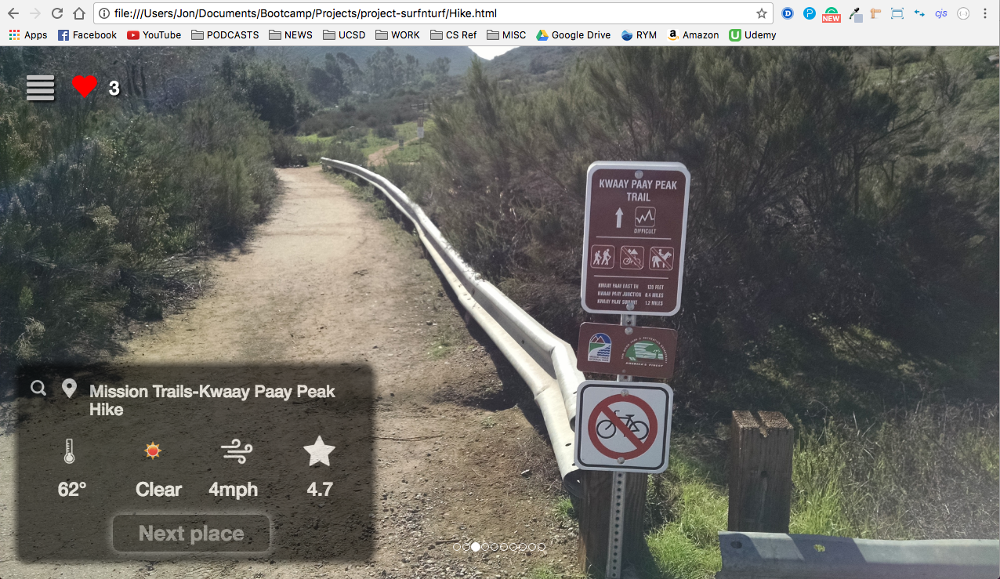

# Surf N' Turf
Surf N' Turf is a web application that allows users to search for nearby hiking and surfing spots while providing them with relevant information such as weather, rating, images, and map location as well as the option to save their favorite places.
## Team
Jon Lee  return
Melissa Nguyen  return
Sean Naylor  return
Tony Afacchini
## APIs
Google Places - Used to get hiking locations, their photos, and ratings.  return
OpenWeatherMap - Used to get the temperature, weather, and wind for both the hiking and surfing spots.  return
Spitcast API - Used to get the surfing specific information such as tides.  return
## Other Technologies
SASS - CSS preprocessor used to style our frontend.  return
Firebase - Used to store the amount of favorites a location has received from users  return
Local storage - Used to store a user's favorite locations.
## Screenshots

